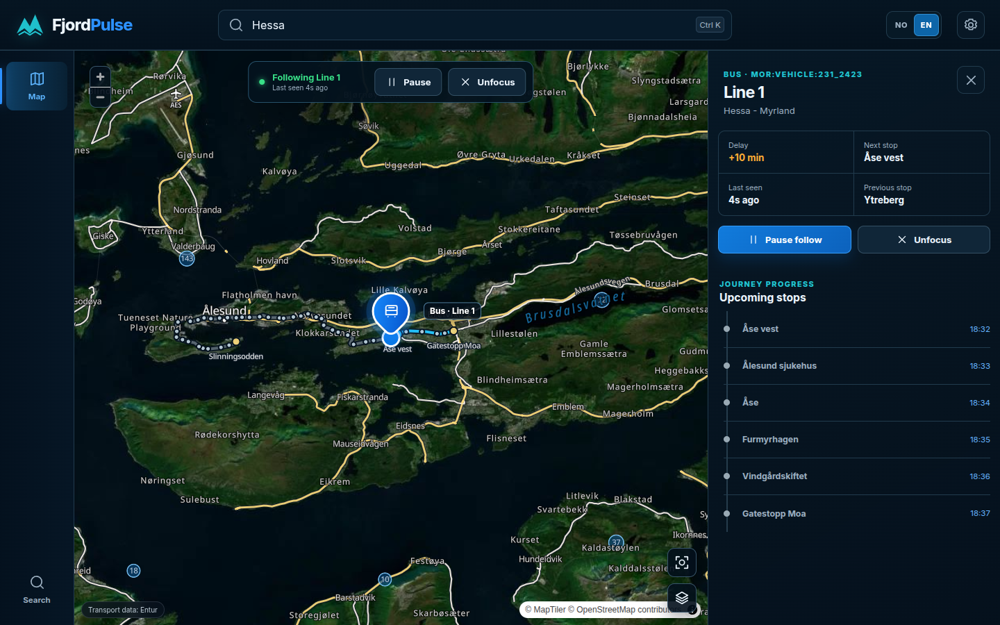
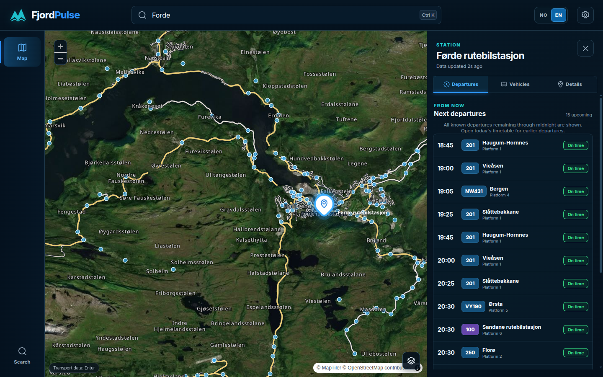
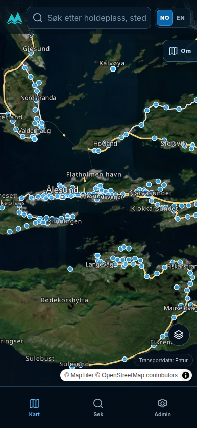
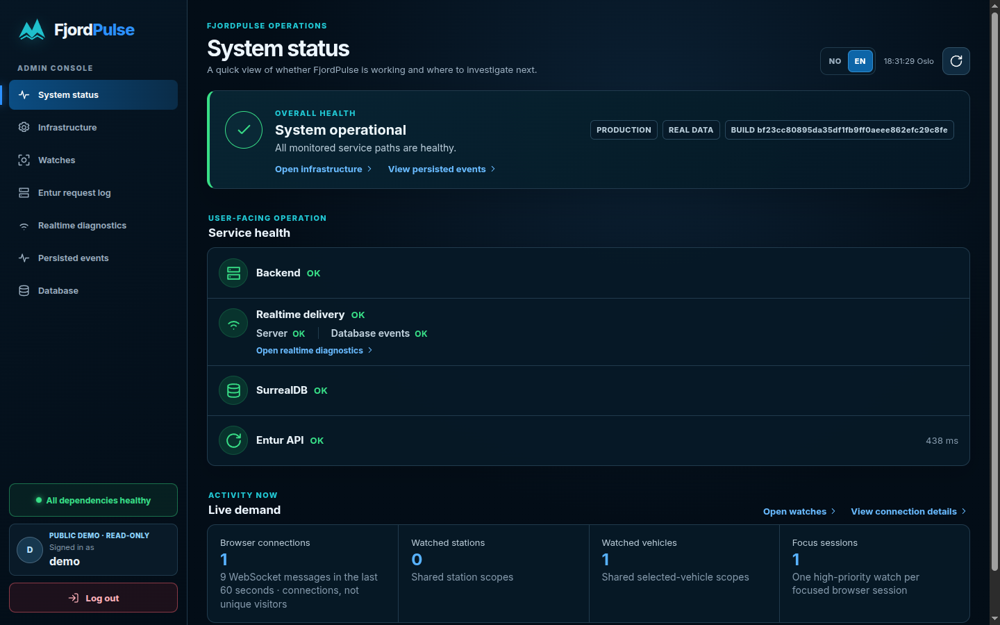
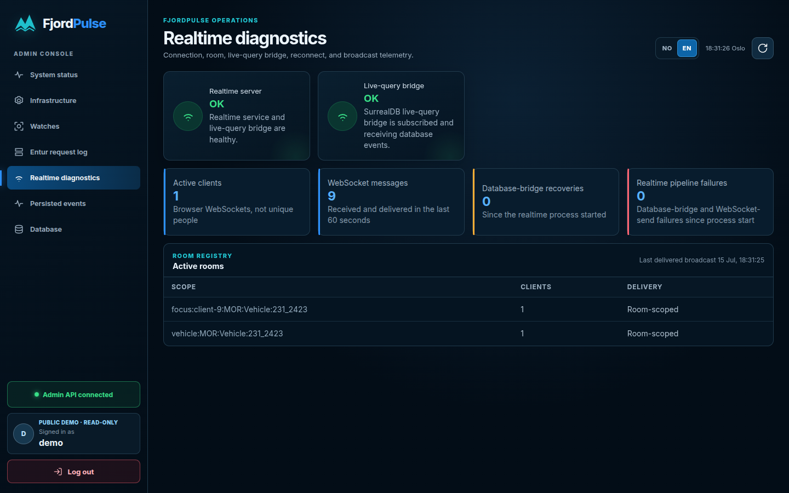
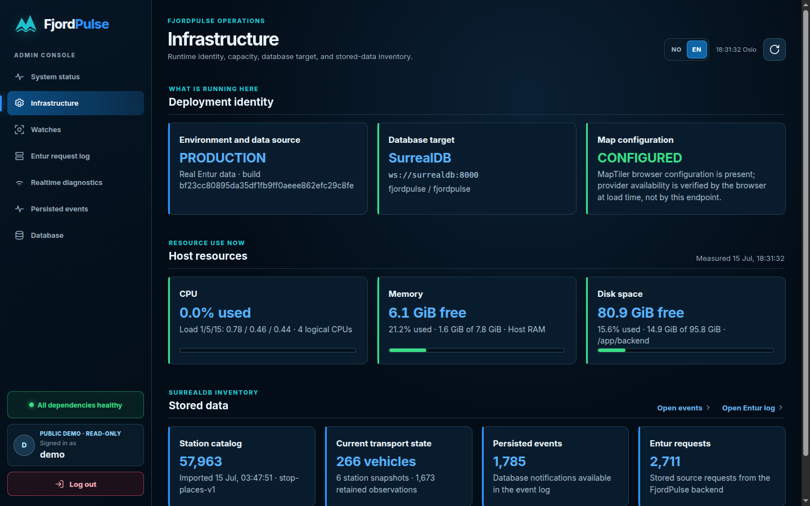
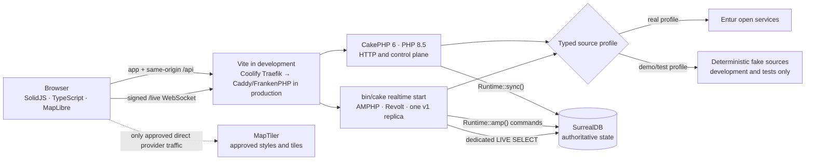
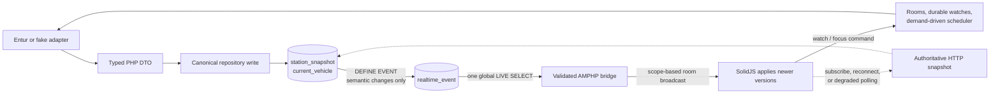
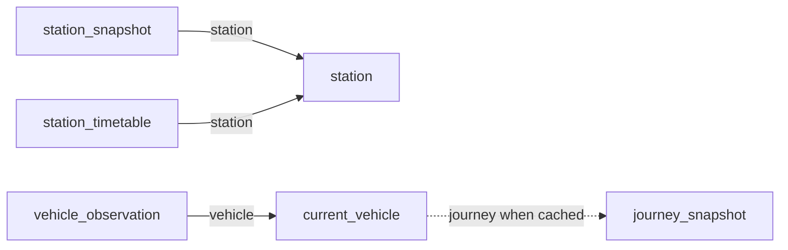
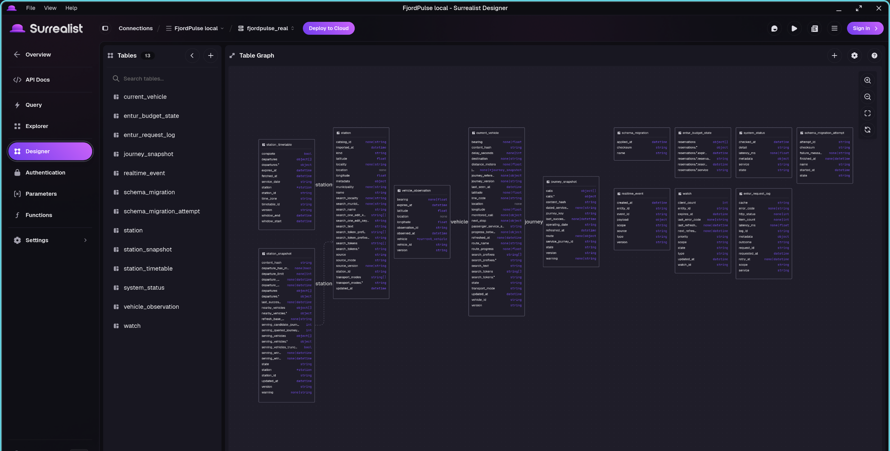

<div align="center">
  
  <h1>FjordPulse</h1>
  <p><strong>Explore Norwegian departures and follow public transport in realtime.</strong></p>
  <p>A map-first transport explorer built with typed PHP, SolidJS, AMPHP, and SurrealDB.</p>

  <p>
    <a href="https://github.com/MartinKavik/FjordPulse/actions/workflows/quality.yml"></a>
    <a href="https://github.com/MartinKavik/FjordPulse/actions/workflows/deploy-production.yml"></a>
    <a href="https://fjordpulse.kavik.cz"></a>
    
  </p>

  <p>
    
    
    
    
    
    
    
  </p>

  <p>
    <a href="https://fjordpulse.kavik.cz">Live demo</a> ·
    <a href="#quick-start">Quick start</a> ·
    <a href="#what-it-does">Features</a> ·
    <a href="#screenshots">Screenshots</a> ·
    <a href="#compatibility">Compatibility</a> ·
    <a href="#architecture">Architecture</a> ·
    <a href="#quality">Quality</a> ·
    <a href="#documentation">Documentation</a>
  </p>
</div>



<p align="center"><sub>Live production capture · Line 1 through Ålesund · satellite map, reported position, planned path, delay, previous/next stop, and upcoming calls · 15 July 2026</sub></p>

> [!NOTE]
> [FjordPulse is live at `fjordpulse.kavik.cz`](https://fjordpulse.kavik.cz).
> The demo uses real Entur data. Coolify owns TLS, Traefik routing, deployment,
> service lifecycle, and the daily backup; embedded Caddy/FrankenPHP serves the
> SolidJS and CakePHP application.

## What it does

- **Find transport naturally.** Search stations with database-indexed prefixes, Norwegian-character folding, and bounded one-edit typo recovery; also find places, lines, and live vehicles—`Forde`, `Førde`, and `Fo` can all find Førde without scanning the national station catalog.
- **Keep the map meaningful.** Start with labelled satellite imagery, switch to Streets, preserve selected pins above clusters, and share the current camera through the URL.
- **Explain a station clearly.** See the next departures through Oslo midnight, open the complete daily timetable, and distinguish vehicles serving the station from other live vehicles within the reported 5 km radius.
- **Follow the actual journey.** Identify buses, ferries, rail, trams, and other reported modes; inspect the planned path, previous stop, next stop, and upcoming calls; then follow or pause the vehicle without losing context.
- **Recover without a reload.** Reconnect browser watches automatically, retain authoritative snapshots during outages, and fall back to HTTP polling when the live-query bridge is degraded.
- **Work across devices and languages.** Norwegian Bokmål is the deterministic default, English is one switch away, and the public app plus read-only Admin console are covered on desktop and mobile.

## Quick start

Install the exact lockfile-backed dependencies, add the browser map key, and start the real-data profile:

```bash
make install
${EDITOR:-vi} .env
# Set MAPTILER_API_KEY in .env
make dev
```

Open <http://127.0.0.1:5173>. The attached process starts SurrealDB, the CakePHP HTTP application, the AMPHP realtime command, and Vite. Stop it with <kbd>Ctrl</kbd>+<kbd>C</kbd> or `make stop` from another terminal.

| Command | Transport data | Storage | Best for |
|---|---|---|---|
| `make dev` | Real Entur services | Persistent `.data/surreal-real` | Normal local use |
| `make dev-demo` | Deterministic fake adapters | Disposable `.run/surreal-demo` | Fast, reproducible demos |
| `make dev-mobile` | Real Entur services | Persistent | Testing from a phone on trusted Wi-Fi |
| `make stop` | — | Preserves real data | Stopping all local services |

Entur's open APIs require **no signup, API key, OAuth client, or localhost token**. `ENTUR_CLIENT_NAME` is a non-secret application identifier sent as `ET-Client-Name`. `MAPTILER_API_KEY` is the only browser-provider key; protect a deployed key with allowed HTTP origins. The browser never calls Entur directly.

The first real start applies migrations and imports roughly 58,000 Entur stop
records; interrupted imports resume. `make dev-mobile` prints the phone URL and
exposes only Vite on trusted Wi-Fi. Local and production Admin offer a separate
**Fill demo credentials** identity whose server-enforced access is diagnostic
and read-only. The [local runbook](docs/LOCAL_DEVELOPMENT.md) covers URLs,
mobile/firewall troubleshooting, profiles, and standalone Surrealist access.

## Screenshots

These PNGs were captured from exact production build
`bf23cc80895da35df1fb9ff0aeee862efc29c8fe` on 15 July 2026. They are not
generated mockups or fixture scenarios; select any image for the full-resolution
point-in-time evidence.

<table>
  <tr>
    <td width="68%">
      <a href="docs/screenshots/production-forde-station.png"></a>
    </td>
    <td width="32%" align="center">
      <a href="docs/screenshots/production-mobile-map.png"></a>
    </td>
  </tr>
  <tr>
    <td align="center"><sub>Førde rutebilstasjon · satellite context and live departures</sub></td>
    <td align="center"><sub>Norwegian mobile map · search and Admin remain one tap away</sub></td>
  </tr>
  <tr>
    <td width="50%">
      <a href="docs/screenshots/production-admin-status.png"></a>
    </td>
    <td width="50%">
      <a href="docs/screenshots/production-admin-realtime.png"></a>
    </td>
  </tr>
  <tr>
    <td align="center"><sub>Health and active demand · one real browser Focus session</sub></td>
    <td align="center"><sub>Healthy bridge · rolling messages · confirmed Line 1 rooms</sub></td>
  </tr>
  <tr>
    <td colspan="2">
      <a href="docs/screenshots/production-admin-infrastructure.png"></a>
    </td>
  </tr>
  <tr>
    <td colspan="2" align="center"><sub>Actual production CPU, free memory, disk, build, and stored-data inventory</sub></td>
  </tr>
</table>

The protected Admin console separates health, capacity, watches, Entur request
evidence, realtime delivery, persisted events, and read-only database
compatibility. The repository additionally keeps [74 bilingual deterministic
visual baselines](tests/visual/__snapshots__) for regression testing. Capture
provenance is recorded beside the [production screenshots](docs/screenshots/README.md).

## Compatibility

| Surface | Supported baseline |
|---|---|
| Web app | A current ES2023 browser with WebGL 2, Fetch, and WebSocket; Chromium is fully automated and Firefox is manually exercised |
| Local development | Linux x86-64, Node.js `22.22.0`, Python 3, GNU Make/Bash, Git, curl, jq, tar/gzip/bzip2, coreutils/util-linux; Xvfb and Playwright libraries for browser gates |
| Production reference | Ubuntu 24.04 x86-64, Docker/Coolify, 4 vCPU, advertised 8 GB RAM (7.8 GiB visible), and advertised 100 GB disk (95.8 GiB filesystem) |

Pinned launchers provide PHP, Composer, FrankenPHP/Caddy, SurrealDB, and Restic,
so they do not need to be installed globally. ARM64, native macOS/Windows, and
Safari/iOS are not yet in the verified matrix. See [compatibility and exact
requirements](docs/COMPATIBILITY.md) for packages, versions, browsers, and
external-service requirements.

## Architecture

### Runtime topology



The browser has no direct Entur or SurrealDB connection. CakePHP owns HTTP and control work; the long-running AMPHP/Revolt service owns WebSockets, rooms, watches, scheduling, and the supervised database event bridge.

### One authoritative realtime publication path



There is no second direct broadcast after a database write. Current SurrealDB records remain authoritative; events are notifications. A subscription or reconnect receives a fresh versioned snapshot, and an unhealthy live-query bridge degrades to HTTP polling before it resynchronizes.

### SurrealDB-native data model



These are typed record references derived by SurrealDB `VALUE` fields, so
Surrealist Designer shows connected schema boxes and Explorer exposes outgoing
and incoming references. They are deliberately not decorative `RELATE` edges;
query-result Graph mode remains reserved for relationships that own data.
`VALUE`-derived search keys, computed WGS84 points, and indexed observation
timestamps keep search, geospatial ordering, and retention in SurrealDB rather
than PHP catalog scans.

<a href="docs/screenshots/local-surrealist-designer.png"></a>

<p align="center"><sub>Local Surrealist Designer after migrations 013–016 · typed station, vehicle, and journey references connect the schema without decorative edge tables</sub></p>

## Stack

| Surface | Technology | Responsibility |
|---|---|---|
| Interface | SolidJS, strict TypeScript, Vite, MapLibre GL JS | Responsive map, search, station and vehicle views, localization |
| HTTP / control | CakePHP 6, PHP 8.5, FrankenPHP normal mode | Public API, health, authentication, Admin diagnostics, snapshots |
| Realtime | AMPHP, Revolt, CakePHP command | WebSocket lifecycle, rooms, watches, timers, source refresh |
| State and events | SurrealDB 3.2, PHP SDK v2 alpha | Canonical documents, typed record references, indexed search/geospatial/time-series state, migrations, semantic events, live queries |
| Transport sources | Typed Entur and fake adapters | Stop Place, Geocoder, Journey Planner, Vehicle Positions |
| Verification | PHPUnit, PHPStan, Vitest, Playwright | Contracts, units, black-box recovery, accessibility, visuals |

Exact alpha and development dependencies are pinned by the committed Composer and npm lockfiles. Third-party arrays are contained inside adapters and mapped into typed DTOs before they enter the application.

## Quality

The table below reflects the current release candidate's locally verified gates.
For point-in-time production evidence, [GitHub Actions quality run
`29428606472`](https://github.com/MartinKavik/FjordPulse/actions/runs/29428606472)
passed exact commit `bf23cc80895da35df1fb9ff0aeee862efc29c8fe` on **15 July
2026**. [Deployment run
`29429291299`](https://github.com/MartinKavik/FjordPulse/actions/runs/29429291299)
then published that screenshot build and verified its public health version.

| Layer | Current evidence |
|---|---|
| Planning | 108 user stories and 340 black-box scenarios accounted for |
| Static analysis | TypeScript typecheck and maximum-level PHPStan passed |
| Contracts and PHP | Realtime/HTTP valid-and-invalid fixtures plus 363 PHPUnit tests and 2,347 assertions passed; one explicit external Entur smoke was intentionally skipped in the offline suite |
| Frontend units | 172 Vitest tests passed |
| Browser behavior | 20 deterministic fixture tests and 17 clean-stack SurrealDB/CakePHP/AMPHP/Vite tests passed |
| Visual regression | 74 Norwegian/English desktop, mobile, Admin, and expanded-state baselines matched |
| Build and infrastructure | Local production build, truth audit, encrypted backup/restore, workflow, topology, and production-screenshot evidence checks passed |
| CI production images | Application and backup images plus their offline runtime/tool smokes passed |
| Workflow runtime | Node 24-compatible `checkout@v6`, `setup-node@v6`, and failure-only `upload-artifact@v7` are pinned and validated; executed actions produced zero annotations |
| Production screenshot baseline | Exact-SHA deployment, migration 012, healthy realtime/database paths, demand-aware Entur evidence, and the public version check passed |

Run the full local gates with:

```bash
make verify-planning
make typecheck
make phpstan
make test
make e2e
make visual
make build
```

The ordinary suite does not require live Entur. Use `make smoke-entur` for the explicit backend-only integration probe. See [PROGRESS.md](PROGRESS.md#final-completion-gates) for the latest exact record and [tests/README.md](tests/README.md) for the test-layer matrix.

## Documentation

| Read | Purpose |
|---|---|
| [Architecture](docs/ARCHITECTURE.md) | Runtime boundaries, data model, demand-driven collection, and failure behavior |
| [SurrealDB live-query flow](docs/SURREALDB_LIVE_QUERY_FLOW.md) | Dedicated connections, event lifecycle, snapshots, and recovery |
| [Local development](docs/LOCAL_DEVELOPMENT.md) | Profiles, configuration, import behavior, phone testing, and troubleshooting |
| [Compatibility](docs/COMPATIBILITY.md) | Verified browsers, operating systems, host tools, pinned versions, and production capacity |
| [Admin measurement reference](docs/ADMIN_MEASUREMENTS.md) | Sources, time windows, reset behavior, and limits for operational metrics |
| [Production deployment plan](docs/PRODUCTION_DEPLOYMENT_PLAN.md) | Sharptech host hardening, manual Coolify, Netlify DNS, secrets, Surrealist, backups, smoke, and rollback |
| [OpenAPI contract](contracts/http/openapi.yaml) | Canonical HTTP operations and DTO shapes |
| [Realtime schemas](contracts/realtime/) | Canonical client, server, and envelope JSON Schemas |
| [Testing strategy](docs/05_testing_strategy.md) | Test layers, visual inventory, resilience timing, and localization contract |
| [User stories](docs/user-stories/00_README.md) | Product acceptance criteria and black-box scenarios |
| [Design inventory](docs/design/00_README.md) | Source references and current coded-state coverage |
| [Architecture decisions](docs/adr/) | Recorded stack, transport, persistence, map, and deployment choices |
| [Readiness review](FINAL_READINESS_REVIEW.md) and [progress](PROGRESS.md) | Delivered scope, verification evidence, and remaining boundary |

### Repository map

```text
frontend/   SolidJS app, clients, deterministic scenarios, and unit tests
backend/    CakePHP HTTP/control, AMPHP realtime, adapters, repositories, migrations
contracts/  OpenAPI, realtime JSON Schemas, fixtures, and traceability
infra/      Caddy/FrankenPHP, Dockerfiles, Compose, backup tools, and deployment artifacts
tests/      Cross-service fixture, clean-stack, resilience, and visual browser tests
docs/       Architecture, ADRs, runbooks, design references, and user stories
```

## Deployment boundary

The production demo follows one managed public edge path:

```text
Netlify DNS → Coolify-managed Traefik → app container :8080
             app container: embedded Caddy/FrankenPHP → CakePHP + SolidJS
```

Traefik is the only public proxy; embedded Caddy serves the application, and
SurrealDB remains private behind an SSH-tunnelled read-only viewer. Coolify
owns exact-SHA deployment and encrypted same-host backups. Those backups cover
application/database mistakes, not loss of the VPS or disk. Operational detail
and restore evidence live in the [infrastructure runbook](infra/README.md),
[deployment record](docs/PRODUCTION_DEPLOYMENT_PLAN.md), and
[deployment ADR](docs/adr/0014-sharptech-single-host-production.md).
