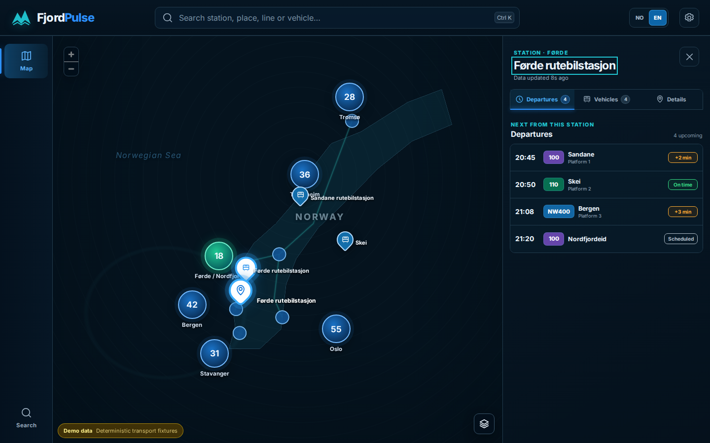
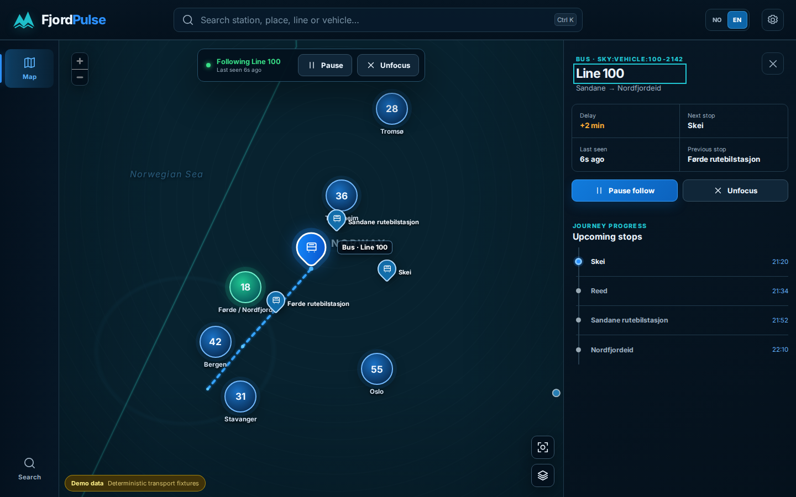
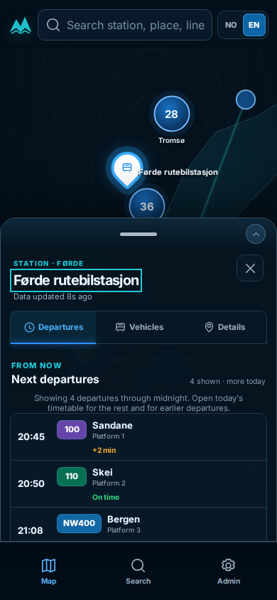
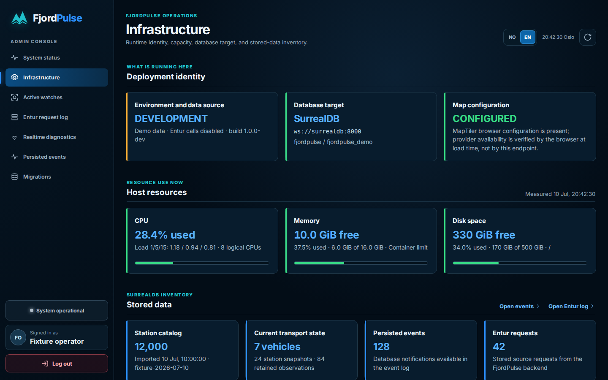
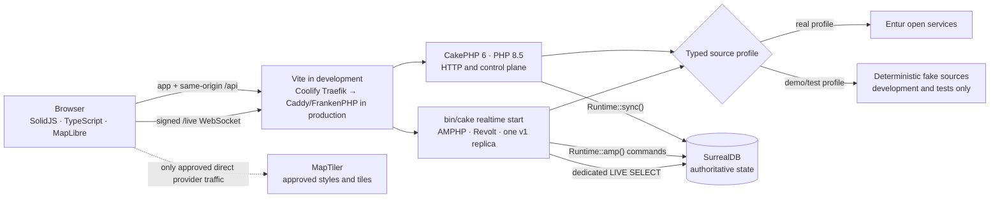
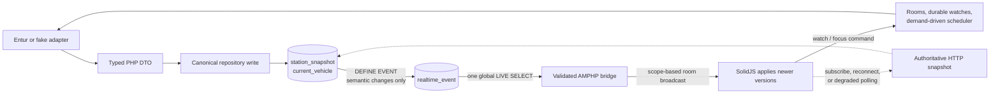

<div align="center">
  
  <h1>FjordPulse</h1>
  <p><strong>Explore Norwegian departures and follow public transport in realtime.</strong></p>
  <p>A map-first transport explorer built with typed PHP, SolidJS, AMPHP, and SurrealDB.</p>

  <p>
    <a href="PROGRESS.md#final-completion-gates"></a>
    <a href="https://fjordpulse.kavik.cz"></a>
    
  </p>

  <p>
    
    
    
    
    
    
    
  </p>

  <p>
    <a href="https://fjordpulse.kavik.cz">Live demo</a> ·
    <a href="#quick-start">Quick start</a> ·
    <a href="#what-it-does">Features</a> ·
    <a href="#screenshots">Screenshots</a> ·
    <a href="#architecture">Architecture</a> ·
    <a href="#quality">Quality</a> ·
    <a href="#documentation">Documentation</a>
  </p>
</div>



<p align="center"><sub>A reviewed application baseline: station discovery, map context, and the compact departure board.</sub></p>

> [!NOTE]
> [FjordPulse is live at `fjordpulse.kavik.cz`](https://fjordpulse.kavik.cz).
> The production demo runs the real Entur profile on a hardened Sharptech VPS.
> Coolify owns deployment, TLS, Traefik routing, container lifecycle and the
> daily backup task; the app container uses embedded Caddy/FrankenPHP to serve
> SolidJS and CakePHP and to proxy `/live` to the single realtime worker.

## What it does

- **Find transport naturally.** Search stations, places, lines, and vehicles with prefix matching, bounded typo tolerance, and Norwegian-character folding—`Forde`, `Førde`, and `Fo` can all find Førde.
- **Keep the map meaningful.** Start with labelled satellite imagery, switch to Streets, preserve selected pins above clusters, and share the current camera through the URL.
- **Explain a station clearly.** See the next departures through Oslo midnight, open the complete daily timetable, and distinguish vehicles serving the station from other live vehicles within the reported 5 km radius.
- **Follow the actual journey.** Identify buses, ferries, rail, trams, and other reported modes; inspect the planned path, previous stop, next stop, and upcoming calls; then follow or pause the vehicle without losing context.
- **Recover without a reload.** Reconnect browser watches automatically, retain authoritative snapshots during outages, and fall back to HTTP polling when the live-query bridge is degraded.
- **Work across devices and languages.** Norwegian Bokmål is the deterministic default, English is one switch away, and the public app plus read-only Admin console are covered on desktop and mobile.

## Quick start

Install the exact lockfile-backed dependencies, add the browser map key, and start the real-data profile:

```bash
make install
${EDITOR:-vi} .env
# Set MAPTILER_API_KEY in .env
make dev
```

Open <http://127.0.0.1:5173>. The attached process starts SurrealDB, the CakePHP HTTP application, the AMPHP realtime command, and Vite. Stop it with <kbd>Ctrl</kbd>+<kbd>C</kbd> or `make stop` from another terminal.

| Command | Transport data | Storage | Best for |
|---|---|---|---|
| `make dev` | Real Entur services | Persistent `.data/surreal-real` | Normal local use |
| `make dev-demo` | Deterministic fake adapters | Disposable `.run/surreal-demo` | Fast, reproducible demos |
| `make dev-mobile` | Real Entur services | Persistent | Testing from a phone on trusted Wi-Fi |
| `make stop` | — | Preserves real data | Stopping all local services |

Entur's open APIs require **no signup, API key, OAuth client, or localhost token**. `ENTUR_CLIENT_NAME` is a non-secret application identifier sent as `ET-Client-Name`. `MAPTILER_API_KEY` is the only browser-provider key; protect a deployed key with allowed HTTP origins. The browser never calls Entur directly.

<details>
<summary><strong>What happens on the first real-data start?</strong></summary>

`make dev` forces `DATA_MODE=real`, applies migrations, and imports the complete Entur Stop Place catalog into the persistent `fjordpulse_real` database. The last verified catalog contained roughly 58,000 source records, so the first import can take a while. Progress is printed for each persisted 1,000-record page; interrupted imports retain their offset and resume on the next start.

The demo profile follows the same HTTP, repository, database-event, live-query, WebSocket, and frontend paths with deterministic source adapters. Its isolated database is recreated for each run, and the UI carries a visible **Demo data** badge.

</details>

<details>
<summary><strong>Test from a phone on the same network</strong></summary>

Run `make dev-mobile`. FjordPulse detects the computer's LAN IPv4 address and prints the exact phone URL. Only Vite is exposed on TCP 5173; CakePHP, realtime, and SurrealDB stay on loopback behind same-origin `/api` and `/live` proxies.

Use this only on a trusted home or office network and run `make stop` afterward. If auto-detection chooses the wrong interface, use `FJORDPULSE_LAN_IP=192.168.x.y make dev-mobile`. See the [local development runbook](docs/LOCAL_DEVELOPMENT.md#manual-phone-testing-on-the-local-network) for firewall and Wi-Fi isolation troubleshooting.

</details>

<details>
<summary><strong>Local URLs and Admin access</strong></summary>

| Surface | URL |
|---|---|
| Public app | <http://127.0.0.1:5173> |
| CakePHP / built UI | <http://127.0.0.1:8080> |
| Realtime health | <http://127.0.0.1:8081/health/realtime> |
| Admin status | <http://127.0.0.1:5173/admin/status> |
| Infrastructure | <http://127.0.0.1:5173/admin/infrastructure> |
| Database schema | <http://127.0.0.1:5173/admin/database/schema> |
| Database migrations | <http://127.0.0.1:5173/admin/database/migrations> |

Local profiles expose a separate demo Admin identity through **Fill demo credentials**. It is not the operator credential. The demo session can only read explicitly allowlisted diagnostics and log out.

The Database area is a typed, read-only release diagnostic—not an embedded SurrealDB console. It can show allowlisted schema and migration compatibility, but it cannot run SurrealQL, edit schema, select arbitrary files, apply, retry, or roll back migrations. Use standalone Surrealist through a private operator connection for record exploration and operator-run queries.

</details>

## Screenshots

These are current, deterministic application captures used by the visual regression suite—not aspirational mockups. Every scenario is reviewed in Norwegian and English.

<table>
  <tr>
    <td width="68%">
      
    </td>
    <td width="32%" align="center">
      
    </td>
  </tr>
  <tr>
    <td align="center"><sub>Vehicle Focus keeps the route, live position, and journey progress together.</sub></td>
    <td align="center"><sub>The mobile sheet leaves map context visible and can snap between sizes.</sub></td>
  </tr>
</table>

<details>
<summary><strong>See the operator-focused Infrastructure view</strong></summary>



The protected Admin console separates rider-facing status from service health, resource capacity, active demand, Entur request evidence, realtime diagnostics, persisted events, and read-only database compatibility.

</details>

The repository contains [74 bilingual reviewed visual baselines](tests/visual/__snapshots__) and a separate [design-reference inventory](docs/design/00_README.md).

## Architecture

### Runtime topology



The browser has no direct Entur or SurrealDB connection. CakePHP owns HTTP and control work; the long-running AMPHP/Revolt service owns WebSockets, rooms, watches, scheduling, and the supervised database event bridge.

### One authoritative realtime publication path



There is no second direct broadcast after a database write. Current SurrealDB records remain authoritative; events are notifications. A subscription or reconnect receives a fresh versioned snapshot, and an unhealthy live-query bridge degrades to HTTP polling before it resynchronizes.

## Stack

| Surface | Technology | Responsibility |
|---|---|---|
| Interface | SolidJS, strict TypeScript, Vite, MapLibre GL JS | Responsive map, search, station and vehicle views, localization |
| HTTP / control | CakePHP 6, PHP 8.5, FrankenPHP normal mode | Public API, health, authentication, Admin diagnostics, snapshots |
| Realtime | AMPHP, Revolt, CakePHP command | WebSocket lifecycle, rooms, watches, timers, source refresh |
| State and events | SurrealDB 3.2, PHP SDK v2 alpha | Canonical state, migrations, semantic events, live queries |
| Transport sources | Typed Entur and fake adapters | Stop Place, Geocoder, Journey Planner, Vehicle Positions |
| Verification | PHPUnit, PHPStan, Vitest, Playwright | Contracts, units, black-box recovery, accessibility, visuals |

Exact alpha and development dependencies are pinned by the committed Composer and npm lockfiles. Third-party arrays are contained inside adapters and mapped into typed DTOs before they enter the application.

## Quality

The complete application and production-image gate sequence passed again for
the first accepted live release on **15 July 2026**. GitHub Actions run
`29383862850` tested exact commit `31a4ec2036a1af897b57e668b3c9406e601a49d9`:

| Layer | Current evidence |
|---|---|
| Planning | 108 user stories and 340 black-box scenarios accounted for |
| Static analysis | TypeScript typecheck and maximum-level PHPStan passed |
| Contracts and PHP | Realtime/HTTP valid-and-invalid fixtures plus 337 PHPUnit tests and 2,133 assertions passed; one explicit external Entur smoke was intentionally skipped in the offline suite |
| Frontend units | 168 Vitest tests passed |
| Browser behavior | 19 deterministic fixture tests and 17 clean-stack SurrealDB/CakePHP/AMPHP/Vite tests passed |
| Visual regression | 74 Norwegian/English desktop, mobile, Admin, and expanded-state baselines matched |
| Production build | App and backup images, offline runtime/tool smokes, build, fixture-truth audit, workflow checks, and infrastructure validation passed |

Run the full local gates with:

```bash
make verify-planning
make typecheck
make phpstan
make test
make e2e
make visual
make build
```

The ordinary suite does not require live Entur. Use `make smoke-entur` for the explicit backend-only integration probe. See [PROGRESS.md](PROGRESS.md#final-completion-gates) for the latest exact record and [tests/README.md](tests/README.md) for the test-layer matrix.

## Documentation

| Read | Purpose |
|---|---|
| [Architecture](docs/ARCHITECTURE.md) | Runtime boundaries, data model, demand-driven collection, and failure behavior |
| [SurrealDB live-query flow](docs/SURREALDB_LIVE_QUERY_FLOW.md) | Dedicated connections, event lifecycle, snapshots, and recovery |
| [Local development](docs/LOCAL_DEVELOPMENT.md) | Profiles, configuration, import behavior, phone testing, and troubleshooting |
| [Production deployment plan](docs/PRODUCTION_DEPLOYMENT_PLAN.md) | Sharptech host hardening, manual Coolify, Netlify DNS, secrets, Surrealist, backups, smoke, and rollback |
| [OpenAPI contract](contracts/http/openapi.yaml) | Canonical HTTP operations and DTO shapes |
| [Realtime schemas](contracts/realtime/) | Canonical client, server, and envelope JSON Schemas |
| [Testing strategy](docs/05_testing_strategy.md) | Test layers, visual inventory, resilience timing, and localization contract |
| [User stories](docs/user-stories/00_README.md) | Product acceptance criteria and black-box scenarios |
| [Design inventory](docs/design/00_README.md) | Source references and current coded-state coverage |
| [Architecture decisions](docs/adr/) | Recorded stack, transport, persistence, map, and deployment choices |
| [Readiness review](FINAL_READINESS_REVIEW.md) and [progress](PROGRESS.md) | Delivered scope, verification evidence, and remaining boundary |

### Repository map

```text
frontend/   SolidJS app, clients, deterministic scenarios, and unit tests
backend/    CakePHP HTTP/control, AMPHP realtime, adapters, repositories, migrations
contracts/  OpenAPI, realtime JSON Schemas, fixtures, and traceability
infra/      Caddy/FrankenPHP, Dockerfiles, Compose, backup tools, and deployment artifacts
tests/      Cross-service fixture, clean-stack, resilience, and visual browser tests
docs/       Architecture, ADRs, runbooks, design references, and user stories
```

## Deployment boundary

The production demo is live on the Sharptech Medium VPS at
`185.248.146.194`. Public traffic follows one managed edge path:

```text
Netlify DNS → Coolify-managed Traefik → app container :8080
             app container: embedded Caddy/FrankenPHP → CakePHP + SolidJS
```

Traefik is Coolify's only public reverse proxy. Caddy is not a competing host
proxy; it is part of the FrankenPHP application image. SurrealDB has no public
domain and exposes only `127.0.0.1:18000` for an SSH-tunnelled, database-scoped
viewer. The real 57,963-record catalog, migrations, app state and event stream
live in its persistent RocksDB volume.

Coolify also owns the daily encrypted logical-backup task and exact-SHA
pre-deployment hook. A live isolated restore matched critical table counts,
migration checksums and a deterministic station sample. Backups intentionally
remain on the same VPS for this low-value demo: they cover application/database
mistakes, not loss or compromise of the whole host or disk. See the
[infrastructure runbook](infra/README.md), [production deployment record](docs/PRODUCTION_DEPLOYMENT_PLAN.md),
and [deployment ADR](docs/adr/0014-sharptech-single-host-production.md).
