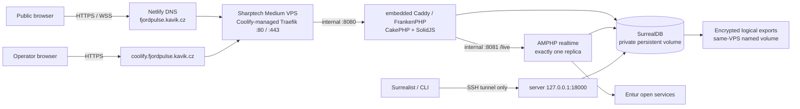

# FjordPulse production deployment plan

Status: **host/control plane/DNS ready and owner claimed; application deployment pending**
Prepared: **2026-07-15**
Public application: **https://fjordpulse.kavik.cz**
Control plane: **https://coolify.fjordpulse.kavik.cz**
DNS authority: **Netlify DNS for `kavik.cz`**
Host: **Sharptech Medium VPS with a manual Coolify installation**

This runbook records the explicitly authorized single-host v1 production
rollout. Each mutation still follows the least-privilege steps and verification
gates below; complete every critical checkbox before calling production ready.

## Deployment decision

Use the provisioned Sharptech Medium VPS for Coolify and the complete
FjordPulse stack. It runs Ubuntu 24.04 on 4 vCPU, 8 GiB RAM and 100 GB NVMe at
`185.248.146.194`. Coolify-managed Traefik is the only public application entry
point. Caddy remains embedded inside the FrankenPHP application container; it
is not another host-level edge proxy.
SurrealDB stays private and is reached by Surrealist or another operator tool
only through SSH forwarding to a loopback-only host port.



Public inbound ports are `80` and `443`; SSH is operator-restricted. Do not
publish `8080`, `8081`, `8000`, or `18000` on a public interface. The browser
still never connects to Entur or SurrealDB.

Sharptech's advertised 4 vCPU is a shared-resource allowance, not a license
for sustained saturation. Its terms prohibit sustained CPU use above 30% of
allocated resources over an extended period and include 1 TiB monthly
transfer. Monitor both, serialize image builds, station imports, backups and
restore drills, and move or resize the workload if normal operation approaches
those limits. A monitored 2 GiB swap file now provides burst safety; it is not
substitute RAM.

## Current preflight observation

These values were observed on 2026-07-15 and must be rechecked immediately
before deployment:

| Check | Observed state | Required action |
|---|---|---|
| `kavik.cz` nameservers | `dns1`–`dns4.p05.nsone.net`, consistent with Netlify DNS | Keep Netlify authoritative |
| Sharptech server | `fjordpulse-01`, Ubuntu 24.04.4 LTS, x86_64, 4 vCPU, 7.8 GiB visible RAM, about 96 GiB usable root disk, IPv4 `185.248.146.194` | Keep the recorded host identity with the deployment evidence |
| SSH access | The 1Password-managed ED25519 key works; root is key-only with `PermitRootLogin prohibit-password`; password login is proven rejected; local-only TCP forwarding remains available for the database tunnel | Preserve panel recovery and retest after Coolify adds its own localhost-management key |
| Container platform | Docker Engine 29.6.1, containerd 2.2.6, Compose 5.3.1 and Coolify 4.1.2 are installed from verified official sources; the Coolify services and proxy are healthy | Keep automatic Coolify updates disabled and record intentional upgrades |
| Network boundary | UFW, Fail2ban and key-only SSH are active; a persistent `DOCKER-USER` policy survived Docker/Coolify restarts; after owner claim, independent IPv4/IPv6 probes reached only public 80/443 and could not reach 8000/6001/6002/8080/18080 | Preserve the policy and re-run the scan after proxy/application changes |
| Provider backup | Sharptech describes a best-effort daily offsite operational backup with restore fee and no SLA/integrity/retention guarantee | Treat it as optional convenience, not as FjordPulse backup or restore evidence |
| `fjordpulse.kavik.cz` | `A 185.248.146.194`, `AAAA 2a12:6bc0:1337:100::189` resolve through public DNS | Keep the records; application TLS/readiness remains a release gate |
| `coolify.fjordpulse.kavik.cz` | `A 185.248.146.194`, `AAAA 2a12:6bc0:1337:100::189` | Keep this dedicated control-plane hostname; do not reuse the unrelated legacy `coolify.kavik.cz` record |
| Coolify TLS | Valid Let's Encrypt certificate for `coolify.fjordpulse.kavik.cz` | Recheck after every proxy or DNS change |
| CAA / DNSSEC | No CAA or DS record observed | Recheck; do not introduce an incompatible inherited CAA or stale DS record |
| GitHub repository | Private, default branch `main` | Use a GitHub App or deploy key scoped only to FjordPulse |
| Repository release evidence | Commit `d9ab68d` is pushed and its exact-SHA GitHub quality run passed every gate; the user-approved same-host backup delta is newer and still requires commit plus a fresh exact-SHA run | Keep deployment disabled until the final backup-policy commit is green |

Commands to repeat:

```bash
dig +short NS kavik.cz
dig +short A fjordpulse.kavik.cz
dig +short AAAA fjordpulse.kavik.cz
dig +short A coolify.fjordpulse.kavik.cz
dig +short AAAA coolify.fjordpulse.kavik.cz
dig +short CAA kavik.cz
dig +short CAA fjordpulse.kavik.cz
dig +short DS kavik.cz
```

## Gate 0 — required before application deployment

The Sharptech host already exists, but no application may be deployed until
this gate is accepted. Gate 0 code being present in the repository does not
prove staging behavior, production configuration, backup recovery or a green
exact GitHub SHA.

| Gate | Implementation state observed on 2026-07-14 | Acceptance evidence still required |
|---|---|---|
| 0.1 Coolify Compose | Implemented with focused topology validation | Disposable-host Compose proof and complete integrated quality run |
| 0.2 RocksDB | Coolify profile uses pinned SurrealDB 3.2.0 and `rocksdb://fjordpulse`; an isolated local persistence smoke passed | Full catalog import, restart, live-query recovery, export and isolated restore |
| 0.3 viewer identity | Typed `VIEWER` bootstrap plus unit/integration coverage are present | Live Surrealist read/write-denial proof through the production tunnel |
| 0.4 backup/restore | Pinned SurrealDB/Restic image and checked scripts are present; the Coolify profile defaults to a stable same-host repository volume with short retention; an end-to-end encrypted backup plus isolated restore smoke passed against the exact binaries | Initialize the production repository, run live short-retention backup and an isolated restore drill; explicitly accept that total host loss also loses every backup |
| 0.5 proxy trust | `TRUSTED_PROXIES`, fail-closed production origin/proxy validation, process-independent single-host HTTP budgets, and spoof/rate-limit/log tests are present | Discover the actual Coolify proxy CIDR and prove deployed HTTPS/WSS/cookie/origin behavior |
| 0.6 CI deployment | Serialized `workflow_run` workflow creates an immutable per-SHA release branch, patches Coolify to it, polls deployment status/commit, and is safely inert without secrets | Configure deploy-only secrets, run it on GitHub and prove the exact tested `main` SHA plus public readiness version |
| 0.7 staging proof | Not performed | Complete every disposable-host and production smoke item below |

### 0.1 Add a Coolify-specific Compose profile

`infra/compose.coolify.yaml` and focused validation now exist in the working
tree. Keep the following properties and prove them on a disposable Linux host:

Required properties:

- remove the fixed top-level Compose project name so Coolify owns its project
  identity; the profile still intentionally reserves production-only global
  volume names and host port `18000`, so never launch a second copy on this
  host;
- do not define custom Docker networks in the Coolify profile—Coolify creates
  the deployment network and attaches its proxy to it;
- replace the app's host `ports` mapping with container-only `expose: [8080]`;
- assign a domain only to `app`, using the Coolify value
  `https://fjordpulse.kavik.cz:8080`; the suffix is the internal container port,
  while visitors still use normal HTTPS port 443;
- give neither `realtime` nor `surrealdb` a public domain;
- retain exactly one realtime replica;
- add only `127.0.0.1:18000:8000` for private operator tunnelling to SurrealDB;
- mark `migrate`, `stations`, and tool-only jobs as excluded one-shot health
  prerequisites where Coolify requires `exclude_from_hc: true`;
- keep the named SurrealDB data volume stable across deployments;
- use `/api/readiness` for the authoritative database/catalog/map deployment
  gate while retaining `/api/health` for runtime liveness and degraded-mode
  diagnostics; verify realtime and bridge health separately before accepting a
  release.

The focused `scripts/validate-infra.mjs` guard now rejects:

- an app host port mapping in the Coolify profile;
- any SurrealDB binding other than server loopback `127.0.0.1:18000`;
- a realtime or database domain/public port;
- custom networks in the Coolify profile;
- more than one realtime replica;
- missing persistence or one-shot ordering.

### 0.2 Use a production-supported SurrealDB storage engine

The generic Compose file remains a local/deployment-oriented baseline. The
Coolify production profile now uses `rocksdb://fjordpulse` with the pinned
SurrealDB 3.2.0 image. SurrealDB's self-hosted guidance describes SurrealKV as
beta and recommends RocksDB for most on-disk self-hosted production workloads.

Focused validation and an isolated restart smoke have passed, but before
deployment still:

1. retain the pinned `surrealdb/surrealdb:v3.2.0` image and verified
   `rocksdb://fjordpulse` URI in the Coolify production profile;
2. run migrations and a complete station import on a fresh volume;
3. restart the database and prove catalog/snapshot persistence;
4. run the live-query-to-browser integration and outage-recovery tests;
5. export and restore the database into another fresh RocksDB volume;
6. retain the hosting/storage decision in ADR 0014 and add the resulting live
   evidence to `PROGRESS.md`.

Do not guess the URI or carry a local SurrealKV directory into RocksDB. Use a
logical export/import if any real data must be moved between engines.

### 0.3 Add a separate operator database identity

The migration command now has production bootstrap support for a distinct
database-level viewer:

```text
SURREAL_OPERATOR_USERNAME=fjordpulse_viewer
SURREAL_OPERATOR_PASSWORD=<unique generated secret>
role: VIEWER on database fjordpulse/fjordpulse
```

Use this account for routine Surrealist and CLI inspection. Never reuse the
root password, application password, Admin operator password, or public Admin
demo password. Root remains break-glass access for migrations, backup/restore,
user administration, and disaster recovery. If an intentional data edit is
ever required, create a separately audited, time-bounded editor instead of
quietly upgrading the viewer.

Unit/integration tests cover the typed role and restrictions. Acceptance still
requires a live Surrealist session through the tunnel proving the viewer can
inspect schema and records but cannot create, update, delete, define, or remove
anything.

### 0.4 Implement real backup and restore automation

Version-pinned backup and restore tooling now exists under `infra/scripts/` and
uses a pinned SurrealDB CLI plus Restic. The repository smoke creates an
encrypted local snapshot, starts a second independently authenticated SurrealDB
process, refuses the source endpoint, rejects source-root credential reuse
through a different endpoint alias, and rejects a non-empty target. It restores
only to the second endpoint and verifies that source and restored records remain
independent with the exact binaries. The Coolify profile defaults to the stable
`fjordpulse-production-backup-repository` volume mounted at `/repository`.
It must:

1. run `surreal export` against the internal database;
2. write a timestamped `.surql` export and SHA-256 checksum;
3. encrypt the snapshot in the local Restic repository;
4. keep the repository in a named volume distinct from the database volume;
5. enforce short retention without overlapping any backup or restore operation;
6. emit structured success/failure output suitable for Coolify notifications;
7. restore into a new isolated database/volume and run record-count plus app
   smoke checks.

Target retention for this demo:

- three daily logical exports;
- one weekly logical export;
- the three newest pre-release exports, each still tagged with its exact SHA;
- an isolated restore drill before the first rollout and after backup changes.

This policy deliberately does not create another storage-provider account. The
database volume and backup volume share one VPS and failure domain: accidental
database damage or a bad migration is recoverable, but deletion, compromise or
loss of the host/disk can destroy both. Total-host recovery is a clean rebuild
from Git plus 1Password-held secrets and may lose all database/Coolify state.
That is accepted for the current non-valuable demo data only. Independent
off-host backup becomes mandatory before storing valuable or irreplaceable data.

### 0.5 Make the HTTP layer proxy-aware without trusting arbitrary headers

The HTTP layer now has an explicit `TRUSTED_PROXIES` boundary and accepts
forwarded client addresses only through configured proxy networks. Untrusted
clients cannot supply an authoritative `X-Forwarded-For`. The production
Coolify proxy CIDR is still unknown and must be discovered on the deployed
Docker network rather than guessed.

Test search, realtime-token, Admin-login, demo-credential, and demo-diagnostic
limits with two external client addresses through the same proxy. Also verify
HTTPS secure cookies, origin checks, generated `wss://` URLs, and structured
request logging behind the proxy.

The HTTP limiter is intentionally a lock-protected single-host store for one
`app` replica in v1. FrankenPHP classic requests share it, as proven by the
black-box login sequence. A container replacement can reset only the current
60-second window. Do not scale `app` horizontally until a deliberately shared
rate-limit design exists.

### 0.6 Add a CI-gated deployment path

`.github/workflows/deploy-production.yml` now provides a serialized
`workflow_run` path and remains a safe no-op until all three Coolify secrets
exist. Coolify 4.1.2 re-resolves Compose deployments from the configured branch,
so a plain webhook is not treated as exact-SHA-safe. The workflow instead:

- accepts only a successful `quality` run for this repository's current `main`;
- creates a never-force-updated `coolify-release/<40-character-SHA>` branch;
- patches the Coolify application to that immutable branch and commit with
  automatic deployment disabled;
- configures Coolify's existing `backup` container to create an encrypted
  `pre_release_<SHA>` snapshot before deployment and abort on backup failure;
- queues one deployment and polls it to a terminal state;
- requires Coolify's reported commit and public readiness `APP_VERSION` to
  equal the tested SHA.

Configure `COOLIFY_URL`, `COOLIFY_TOKEN`, and `COOLIFY_APPLICATION_UUID` as
GitHub Actions secrets only after the application exists. The token needs the
smallest team-scoped `read`, `write`, and `deploy` permissions that support
application patch, deployment start and deployment-status inspection. GitHub
Actions needs repository contents write permission solely to create immutable
release branches; branch protection must forbid force updates/deletion.

The pre-deployment command runs in the currently deployed `backup` container.
Coolify skips pre-deployment commands when no old containers exist, so it does
not make the first release self-protecting. Keep the workflow disabled until a
manual first deployment has created the backup container, initialized Restic,
and a disposable staging deployment has proved that the SHA-tagged command
finishes before migration and that a non-zero backup result blocks deployment.

Docker Compose deployments do not support Coolify rolling updates. Treat each
release as a short reconnect/maintenance window and verify the browser's
existing recovery behavior afterward.

### 0.7 Complete an actual staging Compose proof

Run the Coolify profile on a separate disposable Linux Docker host before
production. Do not use a second resource on the Sharptech host: this
production-only profile deliberately reserves stable global volume names and
loopback port `18000`.

- `docker compose config` succeeds with no unset required variable;
- every pinned image builds/pulls on the selected `amd64` host;
- the exact SurrealDB v3.2 readiness command passes;
- migration and station-import one-shots finish successfully;
- app and realtime become healthy in dependency order;
- only the intended host listeners exist;
- a restart and redeploy preserve database data;
- forced station-catalog refresh is either redesigned as an atomic swap or
  documented as a maintenance-window operation;
- all production smoke scenarios, viewer restrictions, backup, and restore
  pass.

Gate 0 is complete only after the changed full quality sequence and deployment
smoke pass, the work is pushed, and GitHub Actions is green for the exact SHA.

## Step 1 — prepare accounts, keys, and secrets

1. Confirm access to the Sharptech customer panel, Netlify DNS for `kavik.cz`,
   GitHub repository settings, MapTiler key management, and 1Password. No
   object-storage account is required for the accepted demo backup policy.
2. Keep the working ED25519 SSH private key in 1Password and its public key in
   the Sharptech panel/server. Do not keep password-only root access as the
   normal login path.
3. Create a dedicated production MapTiler browser key restricted to
   `https://fjordpulse.kavik.cz`.
4. Generate all private values independently and store them in the vault, not
   in Git, chat, shell history, screenshots, or a local committed `.env`.

Example local generation commands:

```bash
openssl rand -hex 32   # repeat independently for each password
openssl rand -hex 64   # Admin session signing secret
```

The public demo password is intentionally not secret. It must still be
different from every private password and signing secret.

## Step 2 — prepare and harden the Sharptech server

The server is already provisioned; do not reinstall it. Its verified starting
point is:

```text
hostname:       fjordpulse-01
provider/plan:  Sharptech Medium VPS in Norway
OS:             Ubuntu 24.04.4 LTS, x86_64
resources:      4 vCPU, 8 GiB marketed RAM, 100 GB NVMe
IPv4:           185.248.146.194
IPv6:           2a12:6bc0:1337:100::189; production AAAA records active
timezone:       Europe/Prague for host/Coolify; transport display uses Europe/Oslo
current state:  hardened; Docker/Coolify healthy; owner claimed through HTTPS; bootstrap ports closed
```

1. Save the panel/server identifiers, addresses, plan, creation/billing owner,
   host-key fingerprint and recovery path with the deployment evidence.
2. Apply current Ubuntu security updates and reboot if required. Recheck time
   synchronization and the SSH host-key fingerprint after the reboot.
3. Keep the 1Password-managed public key on root and retain Sharptech
   panel/noVNC recovery. Coolify 4.1's documented non-root mode is experimental
   and grants unrestricted passwordless sudo, while the single-host control
   plane manages `localhost` over SSH. Use the documented root boundary:
   `PubkeyAuthentication yes`, `PermitRootLogin prohibit-password`, and
   `PasswordAuthentication no`.
4. Verify a second key-backed root session before closing the first, then prove
   a password-only attempt is rejected. Keep local-only TCP forwarding for the
   SurrealDB tunnel, disable X11 and agent forwarding, and use SSH rate limiting
   plus Fail2ban as secondary controls.
5. Install a Docker-aware host firewall. Permit public TCP 80/443, restrict TCP
   22 to the operator sources where practical, and allow Coolify bootstrap ports
   8000/6001/6002 only temporarily. Deny public 8000, 8080, 8081 and 18000.
   Plain UFW rules alone are insufficient unless their Docker interaction is
   explicitly configured and externally tested; use `DOCKER-USER`/nftables or
   a tested UFW-Docker integration.
6. Retain the configured 2 GiB swap file with `vm.swappiness=10` as protection
   against short build/import bursts. Alert on real RAM pressure and never use
   swap to justify sustained overcommit.
7. Install Coolify manually using the official installer for Ubuntu 24.04,
   configure and verify the dedicated HTTPS control hostname, and submit the
   first-owner credentials only at
   `https://coolify.fjordpulse.kavik.cz`. Never enter credentials at the
   plaintext IP/port bootstrap URL. Close 8000/6001/6002 immediately after the
   claim and store recovery information in 1Password.
8. Record package versions, Docker/Coolify versions, firewall rules, external
   listener scan, swap state and administrator claim as evidence. Keep CPU-heavy
   jobs serialized because Sharptech disallows extended sustained use above
   30% of allocated CPU.

## Step 3 — establish the Coolify control plane

1. Leave the unrelated legacy `coolify.kavik.cz` record unchanged.
2. Create the dedicated FjordPulse control-plane records:

   ```text
   type: A
   name: coolify.fjordpulse
   value: 185.248.146.194

   type: AAAA
   name: coolify.fjordpulse
   value: 2a12:6bc0:1337:100::189
   ```

   Use a short TTL such as 300 seconds during cutover if Netlify exposes the
   field; otherwise use its default. Do not change the apex `kavik.cz` records.
3. Wait until Netlify's authoritative servers plus `1.1.1.1` and `8.8.8.8`
   return the new address.
4. Set the Coolify instance domain to `https://coolify.fjordpulse.kavik.cz`, start/verify
   the proxy, and wait for a valid Let's Encrypt certificate.
5. Use only `https://coolify.fjordpulse.kavik.cz` for claim, login and API
   access. Never enter the owner password at the unencrypted IP/port URL.
6. Remove firewall access to TCP `8000`, `6001`, and `6002`. Confirm the
   dashboard and web terminal still work through HTTPS.
7. Disable automatic Coolify updates for production. Check releases and update
   manually after backing up the Coolify control plane and application data.
8. For this low-value demo, external Coolify notification channels may remain
   disabled by explicit owner choice rather than creating another account.
   Treat direct health/Admin checks as the minimum and add external alerts
   before the service becomes valuable or operationally important.
9. Enable scheduled Docker image/build-cache cleanup, but **never enable unused
   volume cleanup** on this server.
10. Do not configure Coolify object-storage backup for this demo. Preserve its
    `APP_KEY`, SSH keys and all application secrets in 1Password and record the
    configuration needed for a clean reinstall. A total VPS loss may still lose
    Coolify's local state and require manual reconstruction.

## Step 4 — connect the private GitHub repository

1. Generate one dedicated ED25519 deploy key for this resource. Add only its
   public half to `MartinKavik/FjordPulse` with GitHub write access disabled;
   keep the private half only in Coolify's encrypted key store.
2. Do not reuse the operator/root SSH key or grant pull-request/repository write
   access. Keep preview and push-based automatic deployments disabled.
3. Create:

   ```text
   project:      FjordPulse
   environment:  production
   resource:     Private Repository (Deploy Key)
   initial branch: main (automatic deploy disabled; CI later selects an immutable release branch)
   build pack:   Docker Compose
   base dir:     /
   compose file: /infra/compose.coolify.yaml
   ```

4. Disable push-based automatic deployment initially. The first release is
   manual and tied to an explicitly recorded green commit SHA.

## Step 5 — enter production configuration

Add these through Coolify's environment-variable UI/API. With Coolify 4.1.2's
Docker Compose build pack, every value referenced by Compose must be available
to both build orchestration and runtime so `${NAME:?}` interpolation succeeds.
Mark those rows build-time **and** runtime, and mark private values as literal,
locked, and hidden. Coolify writes its build-time env file outside the Docker
build context; the FjordPulse Dockerfiles do not accept secret build arguments
or copy that file. After deployment, verify the image history/config and public
responses contain no private value.

```dotenv
APP_ENV=production
APP_DEBUG=false
APP_VERSION=<exact green commit SHA; the CI workflow updates this before every deployment>
FJORDPULSE_BUILD_CONTEXT=.
APP_ORIGIN=https://fjordpulse.kavik.cz
ALLOWED_ORIGINS=https://fjordpulse.kavik.cz
TRUSTED_PROXIES=<exact Coolify proxy CIDR verified on this host>
REALTIME_PUBLIC_URL=wss://fjordpulse.kavik.cz/live
DATA_MODE=real
SCENARIO=normal

MAPTILER_API_KEY=<dedicated origin-restricted browser key>

SURREAL_NAMESPACE=fjordpulse
SURREAL_DATABASE=fjordpulse
SURREAL_USERNAME=fjordpulse_app
SURREAL_PASSWORD=<unique application database secret>
SURREAL_ROOT_USERNAME=root
SURREAL_ROOT_PASSWORD=<different root database secret>
SURREAL_OPERATOR_USERNAME=fjordpulse_viewer
SURREAL_OPERATOR_PASSWORD=<different viewer secret>

RESTIC_REPOSITORY=/repository
RESTIC_PASSWORD=<unique backup-encryption secret>
BACKUP_HOST=fjordpulse-production
BACKUP_RETENTION_DAILY=3
BACKUP_RETENTION_WEEKLY=1
BACKUP_RETENTION_RELEASES=3
RESTIC_INITIALIZE_REPOSITORY=false

ENTUR_CLIENT_NAME=martinkavik-fjordpulse
ENTUR_GLOBAL_REQUESTS_PER_MINUTE=120
ENTUR_STOP_PLACE_REQUESTS_PER_MINUTE=60
ENTUR_GEOCODER_REQUESTS_PER_MINUTE=20
ENTUR_JOURNEY_REQUESTS_PER_MINUTE=30
ENTUR_VEHICLE_REQUESTS_PER_MINUTE=30

STATION_FRESH_SECONDS=30
VEHICLE_FRESH_SECONDS=10
VEHICLE_STALE_SECONDS=30
VEHICLE_LOST_SECONDS=300
WATCH_TTL_SECONDS=60
FALLBACK_POLL_SECONDS=15
VEHICLE_OBSERVATION_RETENTION_HOURS=24
REALTIME_EVENT_RETENTION_HOURS=24
STATION_IMPORT_PAGE_SIZE=1000
STATION_IMPORT_WRITE_CHUNK_SIZE=1000

ADMIN_USERNAME=<private operator username>
ADMIN_PASSWORD=<unique private operator password>
ADMIN_SESSION_SECRET=<unique 128-character hex secret>

ADMIN_DEMO_ACCESS=true
ADMIN_DEMO_USERNAME=demo
ADMIN_DEMO_PASSWORD=fjordpulse-demo

LOG_LEVEL=info
LOG_FORMAT=json
```

`TRUSTED_PROXIES` is the actual proxy-network CIDR observed after Coolify creates
the deployment network. Do not enter a broad private range or copy a guessed
default. The SurrealDB operator port is fixed by Compose to host loopback
`127.0.0.1:18000`; it is not a public environment setting. `/repository` is the
Coolify profile's stable local Restic volume and is already the Compose default.
Keep `RESTIC_PASSWORD` scoped to the backup service where Coolify permits
per-service variables, and set `RESTIC_INITIALIZE_REPOSITORY=true` only for the
intentional one-time repository initialization.

The last three demo values preserve **Fill demo credentials** in production.
They do not enable fake data: production still requires `DATA_MODE=real`. The
endpoint intentionally reveals the demo username and password, and middleware
limits that session to allowlisted diagnostic `GET` routes plus logout.

This is a deliberate disclosure decision. Public demo users can see read-only
operational status, request evidence, active watch scopes, persisted events,
allowlisted schema, and bundled migration source. They cannot mutate Admin or
SurrealDB. Keep the private operator and all database credentials unrelated.

The exact-SHA deployment workflow updates the unlocked `APP_VERSION` row to the
tested commit before it starts Coolify. Public readiness must return that same
SHA; selecting an immutable Git branch without updating this row is a failed
release configuration.

Keep `FJORDPULSE_BUILD_CONTEXT=.` in Coolify. Coolify 4.1.2 invokes Compose with
the repository root as `--project-directory`, while direct local use resolves
the file from `infra/`; the Compose default `..` is for that direct local path.
The explicit production override makes both invocation modes resolve the same
repository-root Docker build context.

## Step 6 — configure application DNS and TLS

1. In Netlify DNS, ensure `fjordpulse.kavik.cz` is not assigned to a Netlify
   site and remove any conflicting `A`, `AAAA`, `CNAME`, or managed `NETLIFY`
   record at that exact hostname.
2. Keep the already-published records:

   ```text
   type: A
   name: fjordpulse
   value: 185.248.146.194

   type: AAAA
   name: fjordpulse
   value: 2a12:6bc0:1337:100::189
   ```

3. Do not add a wildcard. Do not change `@`/`kavik.cz` or unrelated Netlify
   site records.
4. Keep the verified `AAAA`, then explicitly validate proxy, application, WSS,
   and certificate behavior over IPv6 during rollout. Remove it immediately if
   any of those IPv6 checks fails; a broken AAAA can defeat otherwise healthy
   IPv4 access and certificate validation.
5. If no CAA record exists, no CAA change is required. If the apex later
   restricts issuance, ensure `letsencrypt.org` is allowed for this hostname and
   that no account-specific inherited rule blocks Coolify's account.
6. Netlify DNS currently does not support DNSSEC. Confirm the registrar has no
   stale DS record before relying on the zone.
7. In the Coolify Compose service UI, assign only `app`:

   ```text
   https://fjordpulse.kavik.cz:8080
   ```

8. Deploy/redeploy after DNS is visible. Wait for Coolify to issue TLS; do not
   repeatedly recreate the record or request while resolver caches are
   expiring.

Verification:

```bash
dig +short A fjordpulse.kavik.cz @1.1.1.1
dig +short A fjordpulse.kavik.cz @8.8.8.8
dig +short AAAA fjordpulse.kavik.cz
curl -I http://fjordpulse.kavik.cz
curl -I https://fjordpulse.kavik.cz
openssl s_client -connect fjordpulse.kavik.cz:443 \
  -servername fjordpulse.kavik.cz </dev/null 2>/dev/null \
  | openssl x509 -noout -issuer -subject -dates
```

## Step 7 — perform the first deployment

1. Confirm the exact `main` SHA is pushed and its complete GitHub Actions
   workflow is green.
2. Create a pre-release logical database backup if this is not a fresh empty
   volume.
3. Start a manual Coolify deployment for that SHA.
4. Watch services in order:

   ```text
   surrealdb healthy
     -> migrate exits 0 and bootstraps application + viewer users
     -> stations imports/reuses the complete Entur catalog and exits 0
     -> realtime becomes healthy with its live-query bridge connected
     -> app becomes ready and Coolify routes HTTPS/WSS traffic
   ```

5. The first complete station import may take time. Follow its structured
   `station_import_progress` events rather than cancelling a healthy import.
6. Do not scale realtime above one replica.
7. Record deployed SHA, image identifiers, migration report, station catalog
   count/source, start/end times, and operator.

## Step 8 — production smoke and resilience proof

Run and retain evidence for every item:

### Public boundary

- [ ] `http://fjordpulse.kavik.cz` redirects to HTTPS.
- [ ] HTTPS certificate hostname, issuer, and dates are correct.
- [ ] `/api/health` returns valid JSON and expected production/real state.
- [ ] `/api/readiness` returns `200` only after the authoritative database,
  catalog, and production MapTiler configuration are ready.
- [ ] `/api/health` and Admin diagnostics separately show realtime plus the
  live-query bridge healthy before release acceptance.
- [ ] `/api/map/config` exposes the approved styles without exposing a private
  server secret.
- [ ] Satellite is default, Streets switches correctly, and map tiles load.
- [ ] Search `Forde`, `Førde`, and `Fo`; open a station and daily timetable.
- [ ] Open a live vehicle, verify typed mode, route, progress, and Focus over
  `wss://fjordpulse.kavik.cz/live`.
- [ ] Browser DevTools shows no direct Entur or SurrealDB request.

### Admin boundary

- [ ] **Fill demo credentials** is visible and succeeds.
- [ ] The demo role remains visibly read-only after navigation/reload.
- [ ] Demo diagnostic GETs work; a non-allowlisted/future read and a mutation
  are rejected by server middleware.
- [ ] Private operator login works with a secure cookie and can log out.
- [ ] No Admin response contains any SurrealDB, operator, session, object-store,
  GitHub, or MapTiler secret.
- [ ] Status, Infrastructure, Entur log, realtime, events, schema, and migration
  pages show the production identity and plausible live values.

### Recovery and persistence

- [ ] Restart realtime in Coolify; the same browser page reconnects and
  resubscribes automatically.
- [ ] Restart app; the selected map state and authoritative data recover.
- [ ] Record catalog/data counts, restart SurrealDB, and verify the counts
  remain.
- [ ] Temporarily stop the live-query bridge/database in staging and verify the
  documented degraded/fallback behavior.
- [ ] Confirm an external scan cannot reach `8000`, `8080`, `8081`, or `18000`.
- [ ] Confirm only expected public listeners and restricted SSH exist.

## Step 9 — connect Surrealist and other database tools

SurrealDB remains private. Do not create `db.fjordpulse.kavik.cz` and do not
open a database port in the host firewall.

1. Start an SSH tunnel from the operator workstation:

   ```bash
   ssh -N -L 18000:127.0.0.1:18000 fjordpulse-prod
   ```

   The proven `fjordpulse-prod` alias uses key-only root at
   `185.248.146.194` with the 1Password-managed key. Root is retained because
   self-hosted Coolify manages its localhost over SSH; password authentication
   remains disabled. Keep this terminal/session open while using the database
   tool.
2. Create a Surrealist Desktop connection:

   ```text
   type:       Connection / remote instance
   endpoint:   http://127.0.0.1:18000
   namespace:  fjordpulse
   database:   fjordpulse
   username:   fjordpulse_viewer
   password:   <SURREAL_OPERATOR_PASSWORD from the vault>
   ```

   A tool that explicitly asks for the WebSocket RPC endpoint can use
   `ws://127.0.0.1:18000/rpc` through the same encrypted SSH tunnel.
3. Verify reads and schema inspection work.
4. Verify a harmless attempted write is denied by the viewer role, then discard
   the failed statement.
5. Configure CLI/Postman/other tools against the same local tunnel endpoint and
   viewer identity. Never copy the root or application credential into a
   desktop profile.
6. Close the tunnel after use and confirm the workstation port is gone.

For emergency root work, use a separate short-lived connection procedure,
record the reason, avoid leaving the credential saved in Surrealist, and rotate
it after suspected exposure.

## Step 10 — backup and restore acceptance

Production is not complete until the controlled demo restore layer below is
exercised and its single-host limitation is explicitly understood:

1. **Sharptech operational backup (optional convenience):** Sharptech advertises
   a daily offsite backup, but Sharptech's terms make it best effort, potentially
   charge for restore, allow up to 72 hours for a restore, and provide no SLA or
   guarantee for availability, integrity or retention. It is not a release gate,
   not an independent FjordPulse backup, and not acceptable restore evidence.
2. **Coolify control plane:** no external Coolify backup is configured for this
   demo. Keep `APP_KEY`, SSH keys and application secrets in 1Password and be
   prepared to rebuild the control plane after total host loss.
3. **SurrealDB logical demo backup:** the repository's pinned backup image runs
   `surreal export`, writes a SHA-256 checksum, sends the encrypted Restic
   snapshot to the same VPS's stable named repository volume, retains three
   daily plus one weekly snapshot and the three newest SHA-tagged pre-release
   snapshots, emits structured status, and supports an isolated verified
   restore. It protects only against application/database mistakes, not total
   VPS, disk, provider or host-compromise loss.

Configure the Coolify scheduled task on the `backup` service to execute
`/usr/local/bin/backup-surrealdb` with container `backup`, timeout `3600`, and
cron `15 3 * * *` (03:15 in the currently verified Coolify scheduler `UTC`
timezone). Review
Coolify's scheduled-task history, prove failure visibility with one intentional
non-zero command, and review backup age manually. External notifications and a
dead-man channel are deliberately omitted for this low-value demo; make them
mandatory before the service stores valuable data or receives an operational
SLA. Keep the script's `flock` because the scheduler does not provide the same
overlap guarantee. Run
`BACKUP_KIND=pre_release_<SHA> backup-surrealdb` before a manual release. After
the first deployment, the CI-gated workflow installs the equivalent command as
Coolify's blocking pre-deployment hook, tying the snapshot tag to the tested
release SHA. Pre-release retention is separate from scheduled daily/weekly
retention and keeps the newest three release snapshots. After the one-time
repository creation succeeds, return
`RESTIC_INITIALIZE_REPOSITORY` to `false`.
Never schedule restore; an operator runs `restore-surrealdb` only with a
distinct `RESTORE_HTTP_URL`, dedicated restore-root credentials, the explicit
confirmation guard and recorded evidence. The command rejects the configured
production/source endpoint and any reuse of its root username or password,
preserves the namespace/database collision guard, and requires `INFO FOR DB` to
prove the target database is empty before import.
Backup and restore use the same lock in their shared work volume, preventing a
scheduled backup from overlapping the drill.

Restore drill:

1. choose a local backup and verify its checksum/decryption;
2. start a separately addressed SurrealDB instance with a new volume and
   dedicated root credentials—a second database on the production endpoint is
   not isolated and is rejected;
3. run `surreal import` with the matching pinned server/CLI version;
4. verify migrations, critical table counts, station search, a station snapshot,
   and Admin schema/migration diagnostics;
5. start an isolated app against the restored database and run smoke tests;
6. record duration, recovery point, recovery steps, and cleanup;
7. fail the release gate if the restore is not reproducible.

## Step 11 — release, update, and rollback policy

### Normal release

1. record the exact green commit and its immutable
   `coolify-release/<SHA>` branch;
2. create and verify the pre-release SurrealDB export;
3. ensure the prior application image remains available;
4. let the CI-gated workflow patch Coolify to that release branch, deploy, poll
   the reported commit to `finished`, and verify public readiness/version;
5. expect a short Compose reconnect window;
6. run public, Admin, realtime, persistence, and demo-login smoke;
7. retain evidence and announce completion.

### Application rollback

If no incompatible migration ran, redeploy the exact previous SHA/image and run
smoke. Coolify rollback works only while the local image still exists, so tags
and the recorded SHA remain the durable source of truth.

### Database-incompatible rollback

Migrations are forward-only. Prefer expand/contract changes so the previous app
can run against the newer schema. If that is impossible:

1. stop app and realtime writers;
2. preserve the failed-state database for investigation;
3. create a clean volume;
4. restore the matching pre-release logical export;
5. deploy the matching previous SHA;
6. run the complete smoke suite;
7. explicitly acknowledge loss of writes after the restored recovery point.

Never edit an applied migration or improvise a destructive rollback in the
Admin console; it intentionally has no such operation.

### Platform updates

- keep Coolify automatic updates disabled in production;
- review release notes, back up Coolify plus FjordPulse, then update manually;
- snapshot before OS/Coolify/SurrealDB major changes;
- test SurrealDB upgrades and storage migrations in staging with restore proof;
- retain version-specific flags and image digests for rollback.

## Step 12 — steady-state operations

- [ ] External uptime checks cover HTTPS plus `/api/readiness`.
- [ ] Coolify task history, Admin health, disk usage and backup age are reviewed
  manually; the accepted absence of unattended external alerts is recorded.
- [ ] The manual disk threshold leaves enough room for a build, database export,
  and rollback image; unused-volume cleanup remains off.
- [ ] Daily local logical-backup success and repository disk use are reviewed.
- [ ] Restore drills are recorded after backup/tooling changes.
- [ ] Admin Infrastructure CPU, memory, disk, database target, source mode, and
  catalog provenance are reviewed.
- [ ] Admin realtime, Entur log, and event-retention behavior are reviewed.
- [ ] Sharptech CPU use is reviewed against the provider's extended-use limit;
  builds, catalog imports, backups and drills remain serialized.
- [ ] Monthly transfer remains inside the plan's 1 TiB allowance.
- [ ] Station catalog refresh runs only through the documented safe procedure;
  a forced in-place refresh requires a maintenance window until atomic refresh
  exists.
- [ ] Secrets, SSH keys, viewer/root accounts, deploy-key scope and API-token scope are reviewed
  and rotated on schedule.
- [ ] Sharptech and MapTiler billing/quotas are monitored.

## Demo rollout checklist

The accepted demo boundary requires every application, data-path and recovery
item below to be true. Optional external services and workstation-only tooling
remain visible as follow-ups rather than being disguised as production proof:

- [x] Gate 0 code, tests, ADR, production-image proof and a clean Coolify
  deployment are complete. A second staging resource is intentionally omitted
  for this single-host, low-value demo.
- [x] Exact production SHA is pushed and GitHub Actions is green.
- [x] The externally verified Docker-aware host firewall exposes only 80/443
  publicly and restricted SSH.
- [x] `coolify.fjordpulse.kavik.cz` has valid TLS and direct bootstrap ports are closed.
- [x] `fjordpulse.kavik.cz` has the intended Netlify A and AAAA records.
- [x] The deployed application has valid HTTPS, HTTP redirect, IPv4/IPv6 readiness, and WSS.
- [x] Production is `DATA_MODE=real`; fixture routes/build sentinels are absent.
- [x] SurrealDB uses the tested RocksDB engine and persistent named volume.
- [x] SurrealDB has no public domain or public listener; its only host binding
  is loopback for an SSH tunnel.
- [ ] Open standalone Surrealist from the operator workstation through the SSH
  tunnel. The same database-scoped viewer already passed a transactional
  read/write-denial proof with zero persisted mutation.
- [x] Public Admin demo login works and its deliberately public, read-only
  disclosure is accepted.
- [x] Operator, application, root, viewer and signing secrets are distinct and
  stored as locked Coolify environment values; deployment automation uses a
  separate least-privilege token.
- [x] First encrypted local logical backup and short-retention pass succeeded.
- [x] Isolated restore and application smoke succeeded.
- [x] The accepted loss of both database and backups after total host/disk loss
  is recorded as a demo-only limitation.
- [x] Realtime/browser recovery and database persistence restarts passed.
- [x] Manual health, backup age, scheduled-task history, disk, CPU and memory
  checks pass; absence of unattended external alerts is explicitly accepted.
- [x] Rollback SHA/image and matching pre-release backup are identified.

## Official references

### Sharptech

- [Medium VPS plan and resource/transfer specification](https://shrp.no/en/products/medium-vps/)
- [Terms of service: shared-resource and backup boundaries](https://shrp.no/en/legal/terms-of-service/)
- [VPS getting-started guide](https://shrp.no/en/docs/getting-started-vps/)
- [VPS hardening guide](https://shrp.no/en/docs/secure-your-vps/)

### Coolify

- [Installation and first-admin warning](https://coolify.io/docs/get-started/installation)
- [Docker Compose build pack](https://coolify.io/docs/applications/build-packs/docker-compose)
- [Compose networking, variables, exposure, and one-shot health exclusions](https://coolify.io/docs/knowledge-base/docker/compose)
- [Domains and automatic HTTPS](https://coolify.io/docs/knowledge-base/domains)
- [Firewall ports](https://coolify.io/docs/knowledge-base/server/firewall)
- [Health checks](https://coolify.io/docs/knowledge-base/health-checks)
- [Private repository with deploy key](https://coolify.io/docs/applications/ci-cd/git/private-repositories)
- [Environment variables and runtime-only secrets](https://coolify.io/docs/knowledge-base/environment-variables)
- [Rolling-update limits](https://coolify.io/docs/knowledge-base/rolling-updates)
- [Coolify backup and restore](https://coolify.io/docs/knowledge-base/how-to/backup-restore-coolify)
- [Production update policy](https://coolify.io/docs/knowledge-base/self-update)
- [Automated Docker cleanup](https://coolify.io/docs/knowledge-base/server/automated-cleanup)
- [Monitoring and notifications](https://coolify.io/docs/knowledge-base/monitoring)

### Netlify DNS and certificate validation

- [Netlify DNS records](https://docs.netlify.com/manage/domains/configure-domains/dns-records/)
- [Netlify domain setup and propagation](https://docs.netlify.com/manage/domains/get-started-with-domains/)
- [Netlify SSL/DNSSEC troubleshooting](https://docs.netlify.com/manage/domains/troubleshooting/troubleshoot-ssl-and-https/)
- [Let's Encrypt IPv6 validation](https://letsencrypt.org/docs/ipv6-support/)
- [Let's Encrypt CAA behavior](https://letsencrypt.org/docs/caa/)

### SurrealDB

- [Self-hosted configuration and storage-engine guidance](https://surrealdb.com/docs/manage/self-hosted/configuration)
- [Self-hosted deployment overview](https://surrealdb.com/docs/build/deployment/self-hosted/overview)
- [Surrealist remote connections](https://surrealdb.com/docs/explore/surrealist/getting-started)
- [Database users and built-in roles](https://surrealdb.com/docs/learn/security/authentication/authentication)
- [Self-hosted backup and recovery](https://surrealdb.com/docs/manage/self-hosted/backups-and-recovery)
- [`surreal export` CLI reference](https://surrealdb.com/docs/reference/cli/surrealdb-cli/commands/export)
